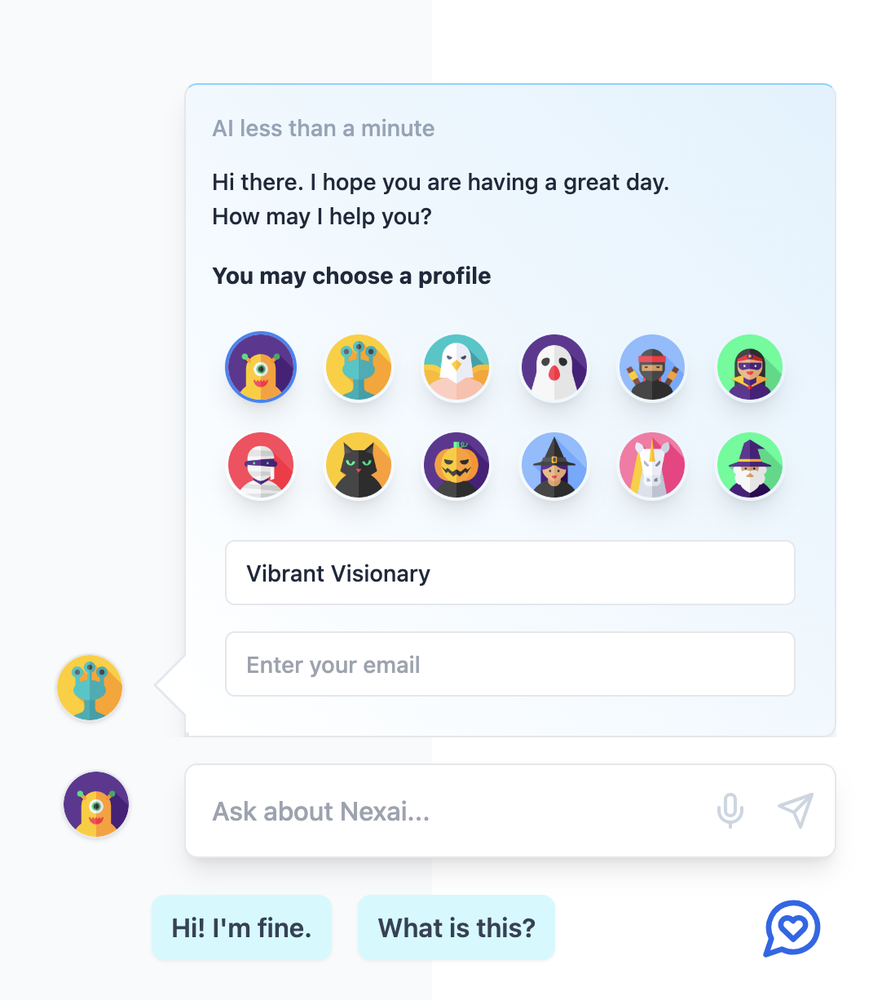

# Nexai AI Chat




## Nexai AI Chat library

```sh
npm install nexai.js
```

The `nexai.js` library facilitates AI chat with a simple interface. 

```ts
import { Nexai } from 'nexai.js'

const nexai = new Nexai({
  nexaiApiKey: 'project-api-key',
})
const resp = await nexai.chat(`How do I use nexai.js`)

```

The full typescript interface

```ts
export declare class Nexai {
    nexaiApiKey: string;
    session: NexaiSession;
    nexaiApiUrl: string;
    constructor({ nexaiApiKey, session }: {
        nexaiApiKey: string;
        session?: NexaiSession;
    });
    chat(message: string): Promise<any>;
    getProjectSocket(): Socket;
    getSessionSocket(): Socket;
}
```

For simple AI queries use nexai.chat(msg). 

If you want to use the socket.io interface you can get it with:

```ts
import { Nexai } from 'nexai.js'

const nexai = new Nexai({
  nexaiApiKey: 'project-api-key',
})
const socket = await nexai.getSessionSocket()

socket.emit('chat', {
  userUid: '',
  projectId: '',
  sessionKey: '',
  message: '',
  fromName: '',
  toName: '',
  avatarUrl: '',
  email: '',
} as IoChatMsg)

socket.on('chat', (msg: IoChatMsg) => {
  console.log('chat', msg)
})

```

### Send and receive project wide AI support messages

You can connect to the projects socket.io namespace which receives any messages sent to the project either from visitors, AI or your chat support personnel. 

```ts
import { Nexai } from 'nexai.js'

const nexai = new Nexai({
  nexaiApiKey: 'project-api-key',
  nexaiSecretKey: 'project-secret-key'
})
const socket = await nexai.getProjectSocket()
socket.on('chat', (msg: IoChatMsg) => {
  console.log('chat', msg)
})
```

You need the secret key to listen on the full project messasges. 

### Your own Socket.io Backend

You can run your own ai chat support server backend and connect to it with:

```ts
import { Nexai } from 'nexai.js'

const nexai = new Nexai({
  nexaiApiKey: 'project-api-key',
  ioUrl: 'http://localhost:8080'
})
const socket = await nexai.getSessionSocket()
```

Clone the git repo and take a look at `server.ts`. It is a very simple socket.io example that calls the nexai.site API to get AI API chat support responses. 

## Nexai React AI Chat Support Bubble

The Nexai AI Support Chat Bubble is a React component designed to facilitate AI-powered support chat for any website.

## Setup

Log into https://nexai.site and create a new project. Add your website to the project then use the API key from the project settings.

## Compatibility

The HTML embed can be embedded onto any website without coding. 

The TypeScript library is compatible with both CommonJS (CJS) and ECMAScript Modules (ESM). It can be used to customize and extend the React Component for use the underlying api to interact with the ai support chat server.

It can run on the browser or server side nodejs or deno.


### HTML Embed Installation

```html
<!-- nexai ai chat bubble -->
<script src="https://nexai.site/ai/chat-bubble.umd.js"></script>
<script>
  // edit to custoize
  NexaiChatBubble.render({
    bottom: 30,
    right: 30,
    width: 400,
    nexaiApiKey: 'your-api-key',
    nexaiIoUrl: '',
    nexaiAssetsUrl: '',
    aiName: 'Nexai',
    aiAvatarUrl: '',
    chatSuggests: [
      'Hello|How do I use it?', 'Help me login|Setup account', 'I\'m happy|I need a human'
    ],
    projectName: 'Nexai',
    inputPlaceholder: 'Ask a question...'
  })
</script>
<!-- end nexai ai chat bubble --->
```

### Library Installation

```sh
npm install nexai.js/chat-bubble
```

### Basic Usage

```js
import { NexaiChatBubble } from 'nexai.js/chat-bubble';

export const App = () => {
  return <NexaiChatBubble nexaiApiKey="your-api-key" />;
};
```

### Development Usage

```sh
git clone https://github.com/nexai-cloud/nexai.js
cd nexai.js
npm install
npm run dev
```

### Props

```ts
export type NexaiChatBubbleProps = {
  width?: number;
  nexaiApiKey: string;
  nexaiIoUrl?: string;
  nexaiAssetsUrl?: string;
  aiName?: string;
  aiAvatarUrl?: string;
  chatSuggests?: string[];
  projectName?: string;
  inputPlaceholder?: string;
}
```

### React Example with all props

```js
import { NexaiChatBubble } from 'nexai.js/chat-bubble';

export const App = () => {
  return (
    <NexaiChatBubble 
      nexaiApiKey="your-api-key"
      width={300}
      nexaiIoUrl="https://io.nexai.site"
      nexaiAssetsUrl="https://nexai.site"
      aiName="Your Bot Name"
      aiAvatarUrl="https://your.site/avatar.png"
      chatSuggests={[
        "Hello|How do I use it?", 
        "Help me login|Setup account", 
        "I'm happy|I need a human"
      ]}
      projectName="Your Project Name"
      inputPlaceholder="Type your message..."
    />
  );
};
```

### Key Components:

1. **Chat Bubble Interface (`./src/chat-bubble`)**: This is the frontend component that users interact with. It provides a user-friendly interface for sending messages and receiving responses from the AI.

2. **Server (`server.js`)**: The server component is built on Express.js and utilizes Socket.IO for real-time, bidirectional communication between the client and server. It handles incoming chat messages from the chat bubble interface, processes them, and sends them to the AI service for response generation.

3. **AI Communication (`Nexai` class)**: This class is responsible for sending user messages to the AI service and retrieving AI-generated responses. It has a simple `nexai.chat(msg)` function or can use the `socket.io` connection with `nexai.getSessionSocket()`.

### How It Works:

- The user interacts with the chat bubble interface to send a message.
- The message is transmitted to the server via a WebSocket connection established by Socket.IO.
- The server receives the message and uses the `sendChatToAi` function to forward the message to the AI service.
- The AI service processes the message and returns a response.
- The server then sends the AI-generated response back to the chat bubble interface, where it is displayed to the user.

This architecture allows for real-time communication with AI-powered support services, providing users with quick and efficient assistance.

### Compatibility:

- The Nexai AI Support Chat Bubble supports both CommonJS and ECMAScript Modules, making it versatile for integration into various JavaScript projects.
- It is designed to be deployed on HTML websites with the HTML embed or with React projects using the React Library. 
- The socket.io server can run in environments that support Node.js, leveraging Express.js and Socket.IO for your own socket.io backend. You can also use the https://nexai.site socket.io service by default or specify your own socket.io server when constructing eg: `const nexai = new Nexai({ nexaiApiKey, ioUrl })`. 

By integrating the Nexai AI Support Chat Bubble into your application, you can enhance user experience by providing instant AI-powered support and assistance.
